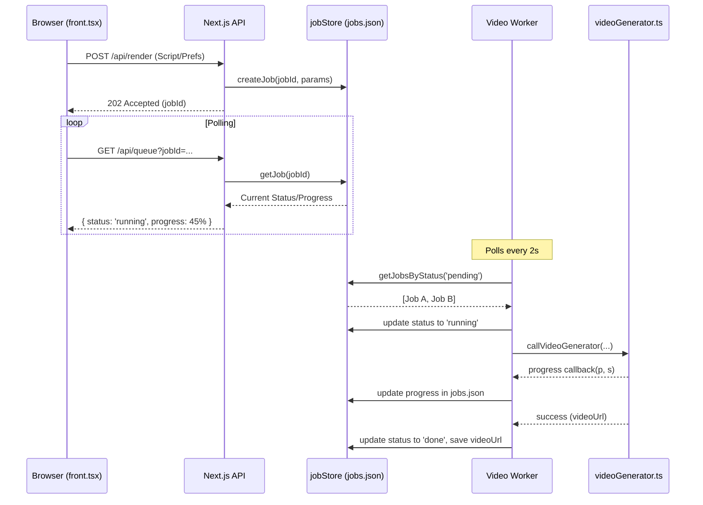

# Video Worker Queue System Reference

This document explains the architecture, files, and data flow of the decoupled video rendering system.

## 🏗️ Architecture Concept: Decoupling

In the previous version, video rendering happened "inline" during an API request. This caused timeout errors (404/504) because video generation takes several minutes, exceeding the browser's or server's wait time.

The new system **decouples** the request from the work:
1.  **Next.js Server**: Only handles HTTP requests, enqueues jobs, and reports status.
2.  **Standalone Worker**: A separate Node.js process that does the "heavy lifting" (FFmpeg, LLM calls, Image Generation) without blocking the web server.

---

## 📁 Key Files & Roles

| File | Role | Responsibility |
| :--- | :--- | :--- |
| `app/front.tsx` | **Frontend (Client)** | Submits job and **polls** the API every 2 seconds for progress updates. |
| `app/api/render/route.ts` | **Enqueue API** | receives request → creates unique `jobId` → saves to `jobs.json` → returns `202 Accepted`. |
| `app/api/queue/route.ts` | **Status API** | Reads `jobs.json` to tell the frontend if the job is `pending`, `running`, or `done`. |
| `workers/jobStore.mjs` | **Data Layer** | Manages `temp/jobs.json`. Ensures atomic writes so the worker and server don't clash. |
| `workers/videoWorker.mjs` | **The Worker** | A standalone process that loops indefinitely, looking for `pending` jobs to process. |
| `app/videoGenerator.ts` | **Engine** | The core logic that generates the video. It now reports progress back to the worker. |

---

## 🔄 The Data Flow

---

## 🛠️ Concurrency & Reliability

-   **Concurrency Control**: The worker is configured (via `MAX_CONCURRENT_RENDERS` in `.env`) to only run a specific number of jobs at once. This prevents your CPU/Memory from crashing.
-   **Atomic Writes**: The `jobStore` writes to `jobs.json.tmp` first and then renames it. This prevents "Partial File" errors if the server and worker try to write at the exact same millisecond.
-   **Graceful Recovery**: If the Next.js server restarts, the `jobs.json` persists. The worker will pick up where it left off.

## 🚀 How to Run

1.  **Terminal A (Web)**: `npm run dev`
2.  **Terminal B (Worker)**: `npm run worker:start`

---

## ⚡ Performance Tuning (`MAX_CONCURRENT_RENDERS`)

Choosing the right number of concurrent renders depends on your hardware and API limits.

### 1. CPU Considerations
Video rendering is extremely CPU-intensive. 
- **Rule of Thumb**: Set concurrency to `Total Logical Cores / 4`.
- For your **12-core system**, a value of **3** is a good starting point for high throughput.
- If you set it to **1**, a single video will finish faster (as it uses all cores), but other users will have to wait in the queue.

### 2. RAM (Memory)
Each render spawns a headless Chrome browser (via Re-video) and an FFmpeg process.
- **Chrome**: ~500MB per process.
- **FFmpeg**: ~200MB - 1GB depending on resolution.
- Ensure you have at least **2GB of free RAM** for every concurrent render you add.

### 3. API Rate Limits
If you are using trial or low-tier API keys (Gemini, ElevenLabs), running **5 videos at once** might trigger "429 Too Many Requests" errors. 
- Keep concurrency low (**1-2**) if your API tiers are limited.

### 🏗️ How to Change it
Update the `MAX_CONCURRENT_RENDERS` value in two places:
1.  **`.env` or `.env.local`** (for `npm run worker:start`)
2.  **`ecosystem.config.cjs`** (if using PM2)
