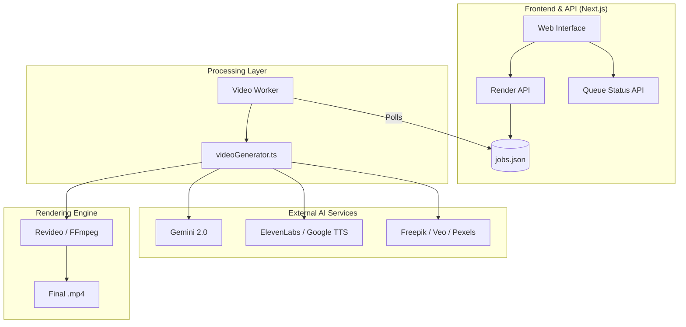

# SaaS Video Generator - Technical Documentation (README2.md)

This document provides a comprehensive overview of the SaaS Video Generator project, designed for developers taking over the project or managing its long-term maintenance.

---

## 1. Product Overview

### Purpose
The **SaaS Video Generator** is an AI-powered engine that transforms text scripts into polished, educational, or promotional videos. It automates the entire pipeline: script analysis, audio synthesis, visual asset generation, and final video rendering.

### Key Features
- **AI Scripting**: Uses LLMs (Gemini) to chunk scripts into visually coherent scenes.
- **High-Quality TTS**: Integrated with ElevenLabs and Google Cloud Text-to-Speech.
- **Automated Visuals**: Generates context-aware images and videos using Freepik (Flux/Hailuo), NanoBanana, Imagen4, and Veo.
- **Dynamic Templating**: Uses Revideo for React-based video composition and animations.
- **Scalable Queue System**: Decoupled worker architecture to handle long-running render jobs without blocking the web server.

### Known Limitations
- **API Latency**: Media generation can take several minutes per video.
- **Rate Limits**: Heavy concurrency may trigger 429 errors from Google or ElevenLabs.
- **Cost**: High-quality video generation (Veo) and image models (Flux) incur significant API costs.

---

## 2. Technical Architecture

### Overall System Architecture
The system follows a decoupled architecture to manage intensive CPU/GPU tasks.



### Tech Stack
- **Framework**: Next.js 14+ (App Router)
- **Language**: TypeScript / Node.js (worker)
- **Rendering**: Revideo (@revideo/core, @revideo/2d)
- **AI Models**: Gemini 2.0, ElevenLabs, Freepik API, Vertex AI (Veo/Imagen), Pexels API.
- **Process Management**: PM2 (for production longevity).

---

## 3. Cost Structure

| Service | Category | Usage Type |
| :--- | :--- | :--- |
| **Google Cloud** | Compute/Storage/AI | GCS storage, Gemini API, Vertex AI (Veo/Speech-to-Text). |
| **ElevenLabs** | Audio | High-quality character voices (Usage-based). |
| **Freepik** | Media | Image generation (Flux) and Video (Hailuo). |
| **Hosting** | Infra | Recommended: High RAM/CPU VPS (8GB+ RAM, 4+ Cores). |

---

## 4. Code & Deployment

### Directory Structure
- `/app`: Next.js frontend and API routes.
- `/workers`: Standalone video worker logic.
- `/revideo`: Revideo project files and render logic.
- `/public`: Static assets and generated video output.
- `/temp`: Temporary files, job storage (`jobs.json`).

### Branch Structure
- `main`: Production-stable code.
- `dev`: Feature development and staging.

### Deployment Flow (Production)
The project uses **PM2** to manage the web server and the worker process concurrently.

1. **Install Dependencies**: `npm install`
2. **Setup Env**: Configure `.env.local` and `dynamication.json`.
3. **Start PM2**:
   ```bash
   npm run pm2:start
   ```
   *This starts `saas2-anim-server` (Port 3000) and `video-worker`.*

---

## 5. Access & Credentials

### Environment Configuration
The system requires a robust `.env` file containing:
- `GEMINI_API_KEY`
- `ELEVENLABS_API_KEY`
- `FREEPIK_API_KEY`
- Google Cloud Service Account (Path to JSON)

### Secure Transfer
- Credentials should be stored in a secure vault (e.g., 1Password, AWS Secret Manager).
- Ownership of Google Cloud and ElevenLabs accounts should be transferred via admin email updates.

---

## 6. Data & Security

### Data Flow
1. **Request**: User inputs script -> API saves job to `jobs.json`.
2. **Worker**: Picks up 'pending' job -> calls APIs -> renders video.
3. **Cleanup**: Temp files are removed post-render or periodically.

### Security Measures
- **Rate Limiting**: Configured via `MAX_CONCURRENT_RENDERS`.
- **Atomic File Ops**: `jobStore.mjs` uses atomic writes to prevent data corruption.
- **Input Validation**: Sanity checks on script length and parameters.

---

## 7. Roadmap & Pending Work

### Open Bugs
- [ ] Occasional timeout on Veo video generation during peak usage.
- [ ] Subtitle alignment drift on very long videos (>5 mins).

### Technical Debt
- **Asset Search API**: Need to finalize the `assetSearch` integration for stock footage fallbacks (currently commented out in `videoGenerator.ts`).
- **State Management**: Consider moving from `jobs.json` to Redis for better multi-worker scaling.

### Immediate Next Priorities
1. **Dashboard for Admin**: Monitoring queue health and API costs in real-time.
2. **Multi-Theme Support**: Enhancing `dynamication.json` with more style options beyond "kids animated".
3. **Image-to-Image Pipeline**: Improve consistency of characters across scenes.
